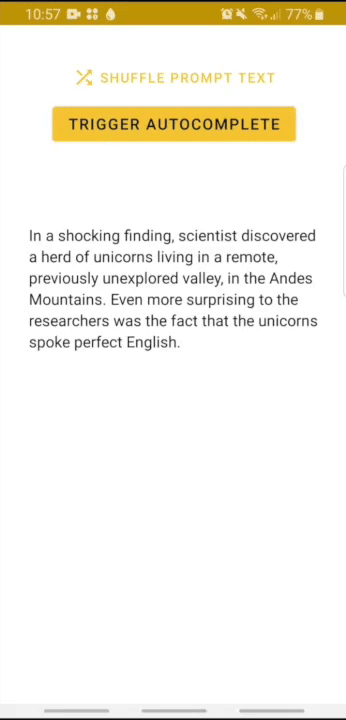

# TensorFlow Lite Transformers w/ Android demos

Convert Transformers models
imported from the [🤗 Transformers](https://github.com/huggingface/transformers) library
and use them on Android. You can also check out our
[swift-coreml-transformers](https://github.com/huggingface/swift-coreml-transformers) repo
if you're looking for Transformers on iOS.

# [Question Answering with DistilBERT](bert)

Demo of the [DistilBERT](https://arxiv.org/abs/1910.01108) model
(97% of BERT’s performance on GLUE) fine-tuned for Question answering on the SQuAD dataset.
It provides 48 passages from the dataset for users to choose from.

# [Text Generation with GPT-2/DistilGPT2](gpt2)

On-device text generation using [GPT-2](https://d4mucfpksywv.cloudfront.net/better-language-models/language_models_are_unsupervised_multitask_learners.pdf) or [DistilGPT2](https://medium.com/huggingface/distilbert-8cf3380435b5) (same distillation process than DistilBERT, 2x faster and 33% smaller than GPT-2)

---

## Models generation

Example scripts used to convert the models are available in the `models_generation` directory.
Please note that they require the nightly version of TensorFlow and might thus be unstable.

## License

[Apache License 2.0](LICENSE)
