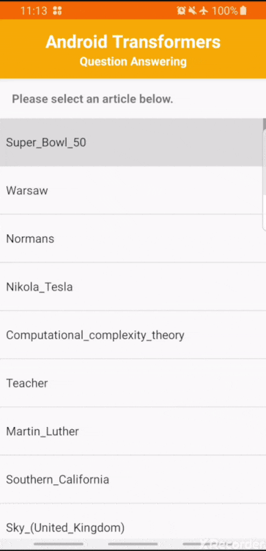

# Question Answering with DistilBERT

The app contains a demo of the [DistilBERT](https://arxiv.org/abs/1910.01108) model
(97% of BERT’s performance on GLUE) fine-tuned for Question answering on the SQuAD dataset.
It provides 48 passages from the dataset for users to choose from.



> Available models:
> * "original" converted DistilBERT (254MB)
> * FP16 post-training-quantized DistilBERT (131MB)
> * "hybrid" (8-bits precision weights) post-training-quantized DistilBERT (64MB)

## Build the demo app using Android Studio

### Prerequisites

*   If you don't have already, install
    [Android Studio](https://developer.android.com/studio/index.html), following
    the instructions on the website.
*   Android Studio 3.2 or later.
*   You need an Android device or Android emulator and Android development
    environment with minimum API 26.
*   The `libs` directory contains a custom build of
    [TensorFlow Lite with TensorFlow ops built-in](https://www.tensorflow.org/lite/guide/ops_select),
    which is used by the app. It results in a bigger binary than the "normal" build but allows
    compatibility with DistilBERT.

### Building

*   Open Android Studio, and from the Welcome screen, select `Open an existing
    Android Studio project`.
*   From the Open File or Project window that appears, select the directory where you cloned this repo.
*   You may also need to install various platforms and tools according to error
    messages.
*   If it asks you to use Instant Run, click Proceed Without Instant Run.

### Running

*   You need to have an Android device plugged in with developer options enabled
    at this point. See [here](https://developer.android.com/studio/run/device)
    for more details on setting up developer devices.
*   If you already have Android emulator installed in Android Studio, select a
    virtual device with minimum API 26.
*   Be sure the `bert` configuration is selected
*   Click `Run` to run the demo app on your Android device.

## Build the demo using gradle (command line)

From the repository root location:

*   Use the following command to build a demo apk:

```
./gradlew :bert:build
```

*   Use the following command to install the apk onto your connected device:

```
adb install bert/build/outputs/apk/debug/bert-debug.apk
```

## Change the model

To choose which model to use in the app:
*   Remove/rename the current `model.tflite` file in `src/main/assets`
*   Comment/uncomment the model to download in the `download.gradle` config file:
```java
"https://s3.amazonaws.com/models.huggingface.co/bert/distilbert-base-uncased-distilled-squad-384.tflite": "model.tflite", // <- "original" converted DistilBERT (default)
// "https://s3.amazonaws.com/models.huggingface.co/bert/distilbert-base-uncased-distilled-squad-384-fp16.tflite": "model.tflite", // <- fp16 quantized version of DistilBERT
// "https://s3.amazonaws.com/models.huggingface.co/bert/distilbert-base-uncased-distilled-squad-384-8bits.tflite": "model.tflite", // <- hybrid quantized version of DistilBERT
```

## Credits

The Bert QA app is forked from the `bertqa` example in the
[tensorflow/examples](https://github.com/tensorflow/examples) repository and uses the same
tokenizer with DistilBERT.
